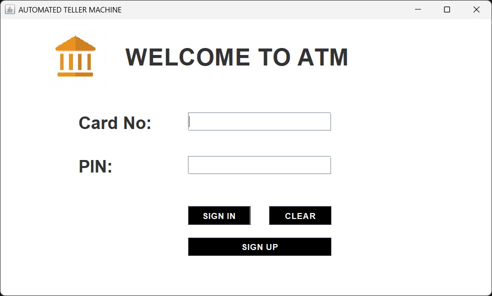
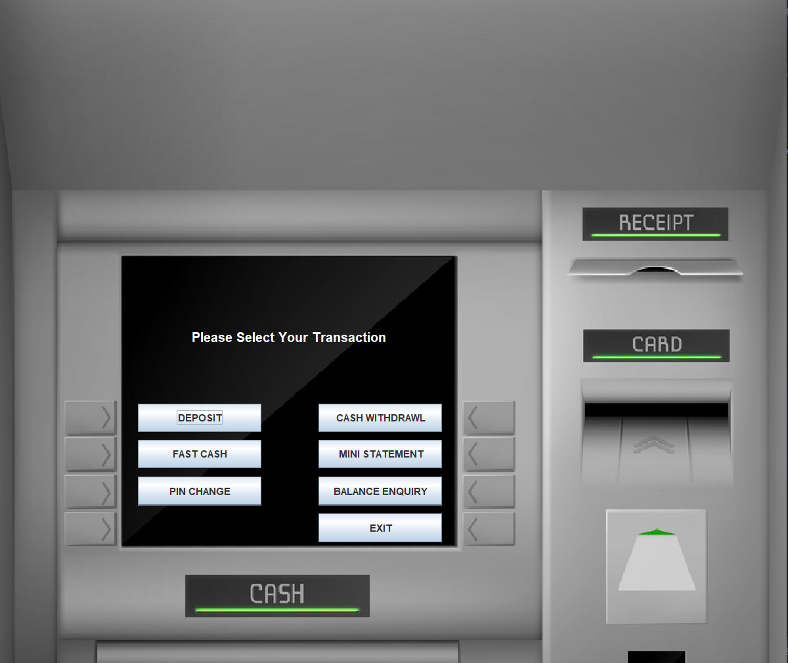
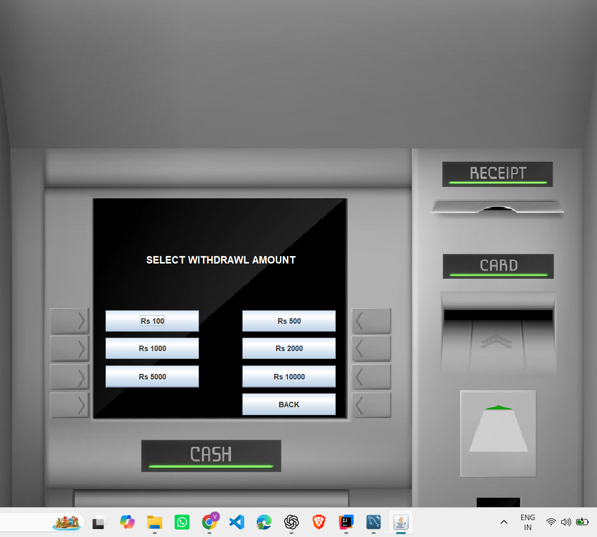
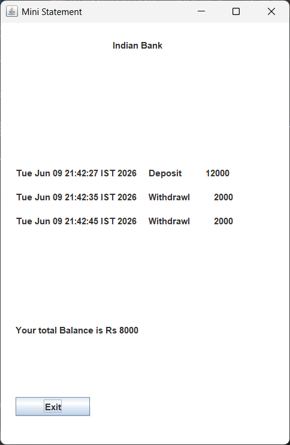

# ATM Management System

A desktop-based ATM Simulator System developed using Java Swing, JDBC, and MySQL. The project simulates real-world ATM operations such as user registration, login, cash withdrawal, deposits, balance enquiry, mini statements, and PIN change through an interactive graphical interface.

## Features

- User Registration
- Secure Login Authentication
- Deposit Money
- Cash Withdrawal
- Fast Cash
- Balance Enquiry
- Mini Statement
- PIN Change
- MySQL Database Integration
- Interactive ATM User Interface

## Technologies Used

- Java
- Java Swing
- JDBC
- MySQL
- IntelliJ IDEA

## Project Structure

```
ATM-Management-System
│
├── src/
│   ├── Login.java
│   ├── Signup.java
│   ├── Signup2.java
│   ├── Signup3.java
│   ├── Transactions.java
│   ├── Deposit.java
│   ├── Withdrawl.java
│   ├── FastCash.java
│   ├── MiniStatement.java
│   ├── BalanceEnquiry.java
│   ├── Pin.java
│   └── Conn.java
│
├── icons/
├── README.md
└── .gitignore
```

## Database Setup

### Create Database

```sql
CREATE DATABASE bankmanagementsystem;
USE bankmanagementsystem;
```

### Create Login Table

```sql
CREATE TABLE login(
    formno VARCHAR(20),
    cardnumber VARCHAR(25),
    pin VARCHAR(10)
);
```

### Create Signup Table

```sql
CREATE TABLE signup(
    formno VARCHAR(20),
    name VARCHAR(50),
    fname VARCHAR(50),
    dob VARCHAR(30),
    gender VARCHAR(20),
    email VARCHAR(60),
    marital VARCHAR(20),
    address VARCHAR(100),
    city VARCHAR(50),
    pincode VARCHAR(20),
    state VARCHAR(50)
);
```

### Create Signup2 Table

```sql
CREATE TABLE signup2(
    formno VARCHAR(20),
    religion VARCHAR(30),
    category VARCHAR(30),
    income VARCHAR(30),
    education VARCHAR(50),
    occupation VARCHAR(50),
    pan VARCHAR(20),
    aadhar VARCHAR(20),
    seniorcitizen VARCHAR(10),
    existingaccount VARCHAR(10)
);
```

### Create Signup3 Table

```sql
CREATE TABLE signup3(
    formno VARCHAR(20),
    accountType VARCHAR(40),
    cardnumber VARCHAR(25),
    pin VARCHAR(10),
    facility VARCHAR(200)
);
```

### Create Bank Table

```sql
CREATE TABLE bank(
    pin VARCHAR(10),
    date VARCHAR(50),
    type VARCHAR(20),
    amount VARCHAR(20)
);
```

## How to Run

1. Clone the repository
2. Open the project in IntelliJ IDEA
3. Configure MySQL database
4. Update database credentials in `Conn.java`
5. Run `Login.java`

## Screenshots

### Login Screen


### Signup Page 1


### Signup Page 2


### Signup Page 3


### Transaction Menu


### Fast Cash


### Mini Statement


## Future Enhancements

- Transaction History Export
- Admin Dashboard
- Password Encryption
- Online Banking Features
- Email Notifications

## Author

**Vivek Vaii**

GitHub: https://github.com/VivekVaii